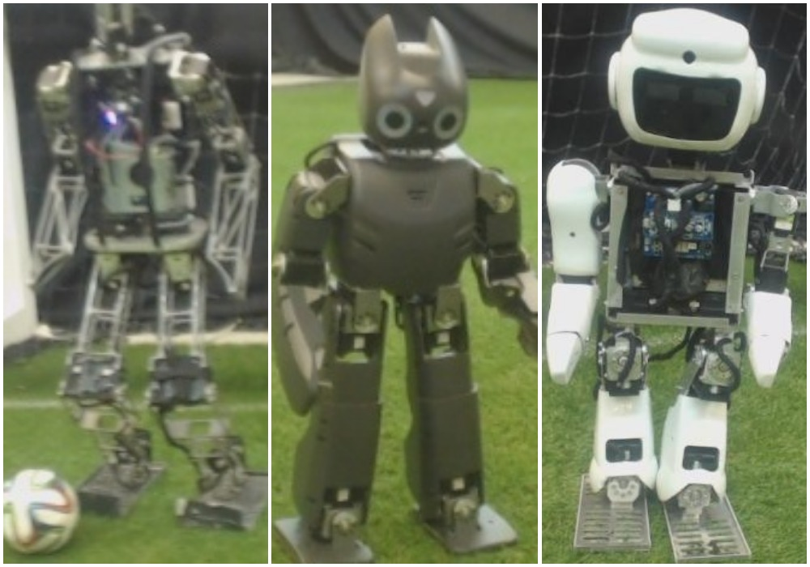

Humanoid Robot Detection Using Deep Learning: A Speed-Accuracy Trade-off
===================

This repository contains:
 * Robot Body Data-Set
 * ImageCropper for Creating Similar Data-Set
 * Python Scripts for Training Deep Networks Using Caffe

"Humanoid Robot Detection using Deep Learning: A Speed-Accuracy Trade-off"<br/>
[Mohammad Javadi](https://github.com/mohammadjv6), [Sina Mokhtarzadeh](https://github.com/sinaazar), [Sajad Azami](https://sajadazami.github.io),<br /> Saeed Shiry Ghidary, Soroush Sadeghnejad, and Jacky Baltes

Submitted to [RoboCup 2017 Symposium, Nagoya, Japan](https://www.robocup2017.org/eng/symposium.html)

Abstract
----------
Recent advances in computer vision have made the detection
of landmarks on the soccer field easier for teams. However, the detection of other robots is also a critical capability that has not garnered
much attention in the RoboCup community so far. This problem is well
represented in different RoboCup Soccer and Rescue Robot Leagues.
In this paper, we compare several two-stage detection systems based
on various Convolutional Neural Networks (CNN) and highlight their
speed-accuracy trade off. The approach performs edge based image seg-
mentation in order to reduce the search space and then a CNN validates
the detection in the second stage. We use images of different humanoid
robots to train and test three different CNN architectures. A part of
these images was gathered by our team and will be publicly available.
Our experiments demonstrate the strong adaptability of deeper CNN's.
These models, trained on a limited set of robots, are able to successfully
distinguish an unseen kind of humanoid robot from non-robot regions.

----------
How to Use This Code in Your Project?
----------
As explained in the paper, three Networks, namely SqueezeNet, LeNet and GoogLeNet are used and each has its own application, depending on how much computational power is available.

First, clone this repository.
```
git clone https://github.com/AUTManLab/HumanoidBodyDetection.git
```

Second, prepare your data-set. You can download our data-set as explained in the section below or use your own images or any other combination.

Third, use one of three Networks to train your model. Evaluation tools will be added soon.

Using Our Data-Set, Adding Your Own
----------

We have published 1500 images from 3 platforms: AKBAR, KIARASH and DARWIN, 500 of each. You can download these images using link below:

[AUT_HUMANOID_BODY](http://ceit.aut.ac.ir/~azami/robot_body_dataset/AUT_HUMANOID_BODY.zip)

Sample images of this data set:




As mentioned in the paper, The problem of recognizing other robot bodies is a critical capability that has not garnered much attention in the Robotics community so far. Since there is no centralized data set for Robot Bodies, we encourage you to add your Robot Body Image data-set link to this repository(just add your link to list below and create a pull request).

Further Robot Body Datasets:

* [SPQR Team NAO image data-set](http://www.dis.uniroma1.it/~labrococo/?q=node/459)

A simple cropping tool is written in QT for creating this data-set, which made the work so fast. We recommend you using ImageCropper for this purpose. Instructions are available in section below.

Using ImageCropper
----------

We have prepared an ImageCropper using OpenCV and Qt library to crop collected images to create our desired data-set. To use it, first:

```
cd "/path/to/HumanoidBodyDetection/ImageCropper"
```

There is an executable file named *ImageCropper* in this directory. You should have the "ImageCropper" copied in a directory along side a folder named *"images"* which contains images you want to crop.

Your structure should be something like this:<br/>
\workspace<br/>
&nbsp;&nbsp;&nbsp;&nbsp;&nbsp;&nbsp;\images<br/>
&nbsp;&nbsp;&nbsp;&nbsp;&nbsp;&nbsp;ImageCropper<br/>

If you are using a Unix-based OS, don't forget to make it executable
```
chmod +x ImageCropper
```

Then, you can run it using:

```
./ImageCropper
```
Now you can see a GUI pannel named "result". To crop an image, first, do left mouse click on the most top left point of your desired boundary, and do the same for most bottom right point of desired boundary.<br/>
Then pressing *'c'* will save a cropped image to *"/path/to/HumanoidBodyDetection/imageCropper/cropped"* directory.
Also, you can exit from the ImageCropper pressing *'q'*.

Feel free to stop anytime, all the changes will be saved and the next time that you wanted to run the ImageCropper, it continues from the last cropped image to the end of the *"images"* directory.

The simple ImageCropper source code is available for editing and promoting, to get a new executable file from the source code, you should run the command:
```
cd /path/to/HumanoidBodyDetection/imageCropper
qmake ImageCropper.pro
```

Training Your Model
----------

blah


#### Reference to This Paper
----------
- Bibtex Here

#### Lisence
----------
Apache License, Version 2.0 (the "License");

